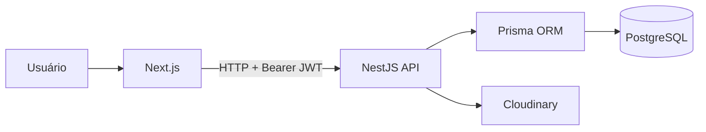

# Imperium Imobiliária

O Imperium Imobiliária é uma aplicação full stack para cadastro, consulta, filtragem e gestão de imóveis. O sistema combina uma interface Next.js com uma API NestJS, autenticação JWT, upload de mídias no Cloudinary e persistência PostgreSQL mapeada pelo Prisma.

## Recursos

- Catálogo público de imóveis para compra e locação;
- Cadastro, edição, consulta e exclusão de imóveis;
- Autenticação de administradores com JWT e bcrypt;
- Upload e exclusão de imagens e vídeos pelo Cloudinary;
- Busca e filtros por finalidade, tipo, localização e características;
- Localização de imóveis com latitude, longitude e integração com mapas;
- Validação de dados no backend com DTOs e `class-validator`;
- Proteções com Helmet, CORS parametrizado, rate limiting e filtro global de exceções;
- Documentação da API com Swagger;
- Testes unitários e testes E2E de segurança e CRUD;
- Deploy do backend preparado para Vercel.

## Arquitetura



O frontend é responsável pela experiência de catálogo e gestão. O backend concentra autenticação, autorização, validação, regras de negócio, persistência e integração com serviços externos.

## Tecnologias

### Frontend

- Next.js 16 e App Router;
- React 19;
- TypeScript;
- Leaflet para mapas;
- Lucide React para ícones;
- ESLint.

### Backend

- NestJS 11;
- TypeScript;
- Prisma 5;
- PostgreSQL;
- JWT e bcrypt;
- Cloudinary;
- Swagger/OpenAPI;
- Jest e Supertest.

## Estrutura

```text
ImperiumImobiliaria/
├── backend/
│   ├── prisma/                  # Schema, migrations e seed
│   ├── src/auth/                # Login, JWT e proteção de rotas
│   ├── src/cloudinary/          # Upload e remoção de mídias
│   ├── src/imoveis/             # CRUD, filtros e regras de imóveis
│   ├── src/prisma/              # Serviço de acesso ao banco
│   └── test/                    # Testes E2E
├── frontend/
│   ├── app/                     # Páginas do App Router
│   └── src/components/          # Componentes reutilizáveis
├── docs/                        # Registros técnicos do projeto
├── package.json                 # Scripts da raiz
└── README.md
```

## Pré-requisitos

- Node.js 20 ou superior;
- npm;
- PostgreSQL, local ou hospedado em Supabase, Neon ou serviço compatível;
- Credenciais do Cloudinary para os recursos de mídia.

## Instalação

```bash
git clone https://github.com/FabianoPiroli/ImperiumImobiliaria.git
cd ImperiumImobiliaria
npm run setup
```

O comando `npm run setup` instala as dependências do backend e do frontend e gera o cliente Prisma pelo `postinstall` do backend.

## Configuração local

Crie o arquivo de ambiente do backend a partir do exemplo:

```powershell
Copy-Item backend/.env.example backend/.env
```

Preencha as variáveis de banco, autenticação, CORS e Cloudinary em `backend/.env`. O arquivo `.env.example` é versionado; arquivos `.env` não são.

As variáveis mais importantes são `POSTGRES_PRISMA_URL`, `POSTGRES_URL_NON_POOLING`, `JWT_SECRET`, `ADMIN_EMAIL`, `ADMIN_PASSWORD`, `FRONTEND_URL` e as variáveis `CLOUDINARY_*`.

## Banco de dados

As migrations estão versionadas em `backend/prisma/migrations`. Para gerar o cliente e aplicar migrations já existentes:

```bash
cd backend
npx prisma generate
npx prisma migrate deploy
npm run db:seed
```

Para conferir o estado do banco:

```bash
npx prisma migrate status
```

O comprovante versionado dessa verificação está em [docs/migrations.md](docs/migrations.md).

## Executando

Na raiz, em terminais separados:

```bash
npm run dev:backend
npm run dev:frontend
```

- Frontend: `http://localhost:3001`;
- API: `http://localhost:3000`;
- Swagger: `http://localhost:3000/api/docs`.

## Scripts principais

| Comando | Descrição |
| --- | --- |
| `npm run setup` | Instala dependências do backend e frontend |
| `npm run dev:backend` | Inicia o backend em modo de desenvolvimento |
| `npm run dev:frontend` | Inicia o frontend em modo de desenvolvimento |
| `npm run build` | Compila backend e frontend |
| `npm --prefix backend run test` | Executa testes unitários |
| `npm --prefix backend run test:e2e` | Executa testes E2E |
| `npm --prefix backend run lint` | Executa o lint do backend |
| `npm --prefix frontend run lint` | Executa o lint do frontend |

## Endpoints principais

| Método | Endpoint | Descrição |
| --- | --- | --- |
| `POST` | `/auth/login` | Autentica o administrador |
| `GET` | `/imoveis` | Lista e filtra imóveis |
| `GET` | `/imoveis/:id` | Consulta um imóvel |
| `POST` | `/imoveis` | Cadastra um imóvel autenticado |
| `PUT` | `/imoveis/:id` | Atualiza um imóvel autenticado |
| `DELETE` | `/imoveis/:id` | Exclui um imóvel autenticado |
| `POST` | `/imoveis/:id/midias` | Envia uma mídia para o Cloudinary |

Rotas protegidas exigem `Authorization: Bearer <token>`.

## Testes e qualidade

```bash
cd backend
npm test
npm run test:e2e
npm run build

cd ../frontend
npm run build
```

Os testes E2E verificam autenticação, autorização, validações, proteção contra payloads inválidos, SSRF, SQL injection/XSS e o ciclo de vida do CRUD de imóveis.

## Segurança

- Senhas armazenadas com bcrypt;
- JWT para autenticação de rotas administrativas;
- DTOs com whitelist e rejeição de campos desconhecidos;
- Helmet para headers defensivos;
- Rate limiting global;
- CORS configurado por variável de ambiente;
- Consultas persistentes executadas pelo Prisma;
- Validação de URLs de mapas e bloqueio de endereços internos;
- Segredos e arquivos `.env` fora do versionamento.

## Deploy

O backend possui configuração para execução serverless na Vercel em `backend/vercel.json`. O frontend pode ser publicado como projeto Next.js separado. Em produção, configure as variáveis de ambiente e execute `npx prisma migrate deploy` com a conexão do banco de produção.

## Próximos passos

- Criar e acompanhar Issues para as próximas funcionalidades;
- Centralizar a documentação dos integrantes da equipe;
- Configurar CI para lint, testes e build;
- Documentar o processo de deploy do frontend.
